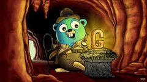

<h1 align="center">
  
</h1>

<h4 align="center">
	Go Barber
</h4>

  

  

  

  

  

   

## 📄 Sobre o curso

Curso apresentado por <strong>Leonardo Leitão</strong> na plataforma <strong>Udemy</strong>.

Link do curso: https://www.udemy.com/course/curso-go/